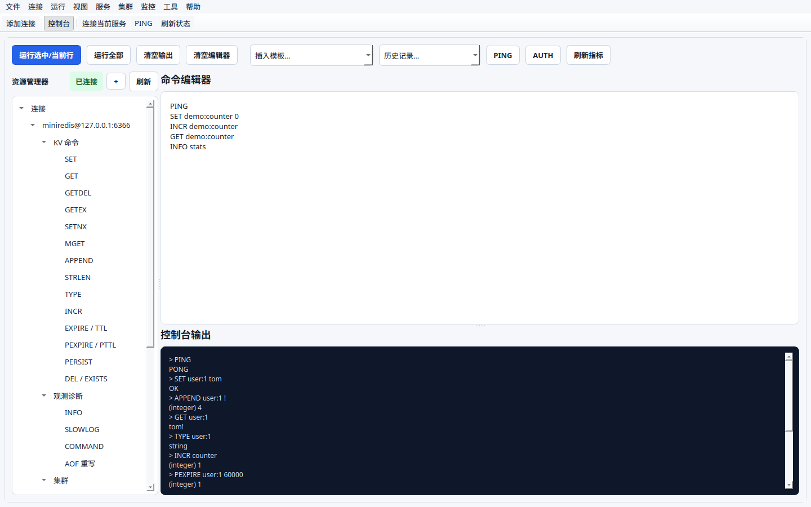
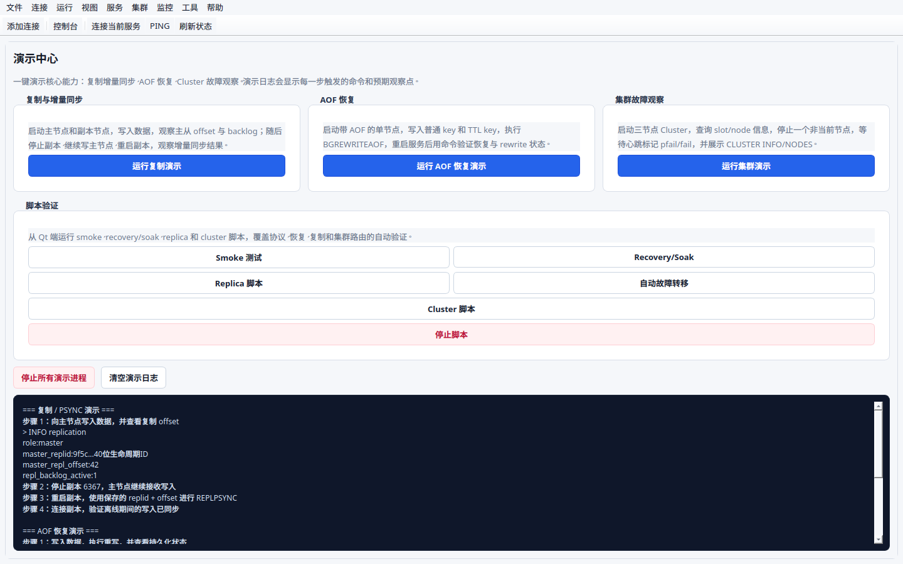
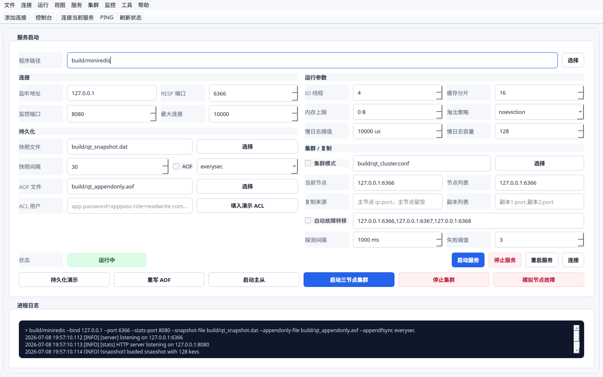
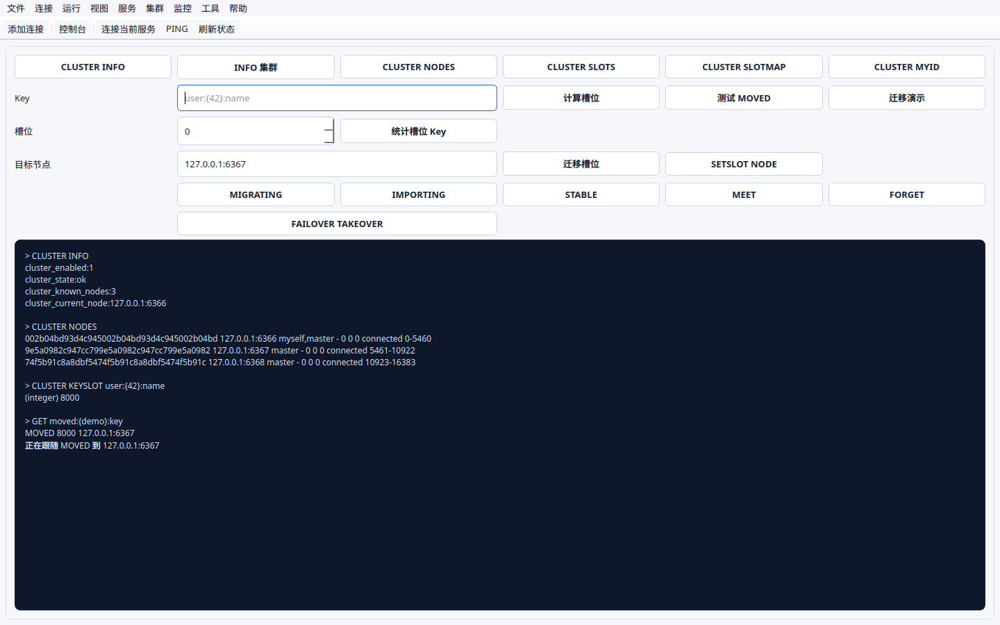
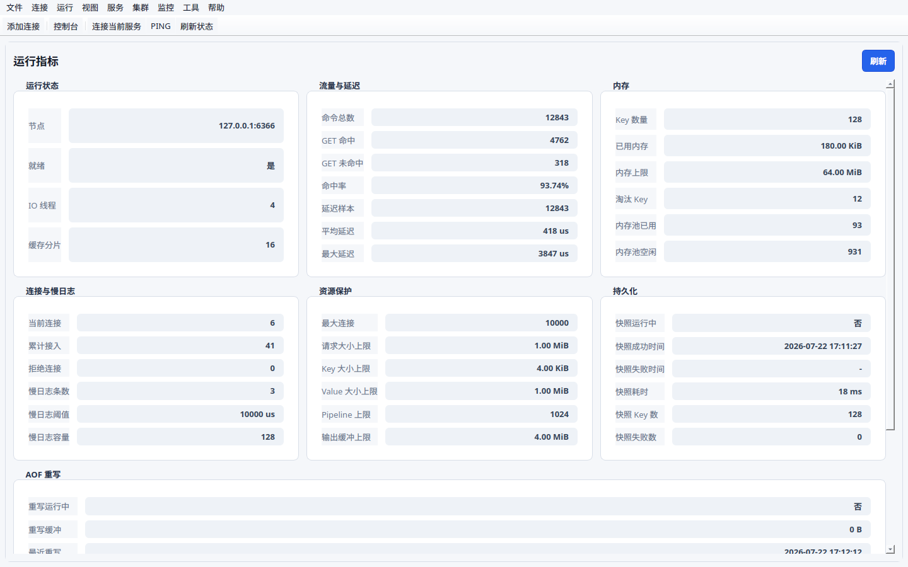
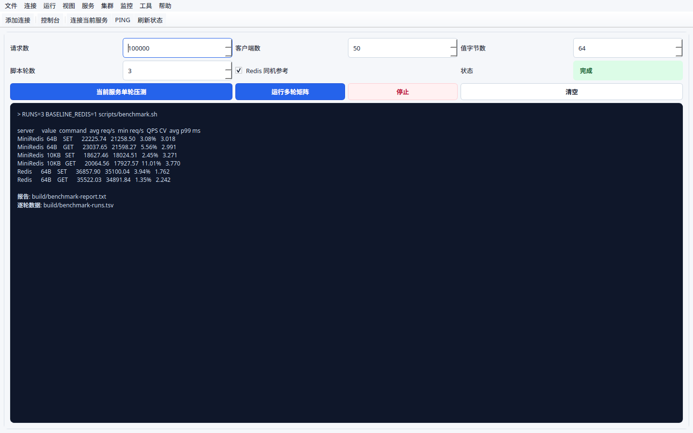

# MiniRedis

MiniRedis 是一个面向本地和内网后台服务的轻量级 KV 缓存中间件，使用 C++20、coroutine、epoll 和 CMake 实现。围绕网络 IO、协议解析、并发控制、持久化恢复、监控和 experimental cluster 路由做工程化练习与演示。

## 项目亮点

- C++20 coroutine + epoll 多 Reactor 网络模型，accept reactor 分发连接，worker reactor 负责客户端 IO。
- 支持 RESP 协议和常用命令：`PING`、`AUTH`、`ACL`、`SET`、`SETNX`、`GET`、`MGET`、`APPEND`、`STRLEN`、`INCR/DECR`、`INCRBY/DECRBY`、`DEL`、`EXISTS`、`EXPIRE`、`TTL`、`COMMAND`、`INFO`、`SLOWLOG`、`BGREWRITEAOF`。
- CacheStore 按 key hash 分片，结合 `std::shared_mutex` 降低多客户端读写锁竞争。
- 64B 固定块内存池复用小 value，大 value 走堆分配。
- 支持 TTL、惰性删除、后台 cleanup、`maxmemory` 和 `noeviction/lru` 淘汰策略。
- 支持 TTL-aware 二进制 snapshot、AOF 增量日志、AOF rewrite、坏尾恢复、rewrite 失败重试和损坏 snapshot 回退。
- 提供 `/healthz`、`/readyz`、`/stats` 和 Prometheus `/metrics`，暴露连接、延迟、资源限制、snapshot、AOF rewrite 等指标。
- 支持 AUTH、轻量 ACL、安全默认 bind、连接数限制、请求大小限制、优雅停机、Docker 和 systemd 部署示例。
- 提供简化 replication、轻量 replication backlog/PSYNC 增量同步、experimental Redis Cluster 风格 slot 路由、`MOVED/ASK`、slot 迁移和手动 failover takeover。
- 提供 Qt Console，可视化演示命令编辑、Demo Lab、服务启停、Replication、Cluster、Diagnostics、Observability、Metrics 和 Benchmark。

## 跨平台定位

MiniRedis 采用 Linux-first 服务端设计：服务端网络层使用 `epoll/eventfd/POSIX socket`，面向 Linux 内网服务器部署；Qt Console 作为管理和演示端，通过 RESP/HTTP 连接服务端，适合做跨平台客户端。

| 模块 | Linux | Windows | macOS |
|---|---:|---:|---:|
| MiniRedis 服务端 | 支持 | 不支持 | 不支持 |
| Qt Console 管理端 | 支持 | 支持/计划支持 | 支持/计划支持 |
| Docker 运行服务端 | 支持 | 通过 Docker Desktop | 通过 Docker Desktop |
| systemd 部署 | 支持 | 不适用 | 不适用 |

构建边界：

- Linux 默认构建服务端和测试。
- 非 Linux 默认关闭服务端和测试；如需构建 Qt Console，使用 `-DMINIREDIS_BUILD_QT_CONSOLE=ON`。
- 如果在 Windows/macOS 强制开启 `MINIREDIS_BUILD_SERVER=ON`，CMake 会给出明确错误提示。

## 快速开始

```bash
cmake -S . -B build -DCMAKE_BUILD_TYPE=Release
cmake --build build -j

./build/miniredis --requirepass change-me
```

另开终端：

```bash
redis-cli -p 6366 -a change-me PING
redis-cli -p 6366 -a change-me SET foo bar
redis-cli -p 6366 -a change-me GET foo
redis-cli -p 6366 -a change-me INFO memory

curl http://127.0.0.1:8080/healthz
curl http://127.0.0.1:8080/metrics
```

Docker:

```bash
export MINIREDIS_REQUIREPASS='change-me'
docker compose up --build
```

更多构建、配置和部署说明见 [docs/usage.md](docs/usage.md)。

## Qt Console

Qt Console 是项目的可视化演示入口，尽量减少对终端命令的依赖：

- Console：提供资源树、多行命令编辑器、命令模板、历史记录、执行输出、错误提示、运行摘要和命令参考。
- Demo Lab：一键演示 Replication/PSYNC、AOF Recovery 和 Cluster 故障观察流程，尽量减少终端依赖。
- Server：启动单节点、master/replica、三节点 cluster，配置 AOF、maxmemory、IO threads、cache shards 等参数。
- Cluster Routing：查询 `CLUSTER INFO/NODES/SLOTS/SLOTMAP`，演示 `MOVED/ASK`、slot 迁移和节点故障。
- Observability：展示 `/stats` 中的命令数、命中率、连接数、内存、慢日志、资源限制、snapshot 和 AOF rewrite 状态。
- Diagnostics：触发 `/healthz`、`/readyz`、`INFO`、`ACL`、`SLOWLOG` 等排障入口。
- Benchmark：调用 `redis-benchmark` 和 `scripts/benchmark.sh` 输出 QPS 与延迟数据。

构建运行：

```bash
cmake -S . -B build-qt \
  -DCMAKE_BUILD_TYPE=Release \
  -DMINIREDIS_BUILD_QT_CONSOLE=ON \
  -DMINIREDIS_ENABLE_INTEGRATION_TESTS=OFF

cmake --build build-qt -j
./build-qt/tools/qt_console/miniredis_qt_console
```

在 Windows/macOS 上只构建 Qt Console 时，推荐显式关闭服务端和测试：

```bash
cmake -S . -B build-qt \
  -DCMAKE_BUILD_TYPE=Release \
  -DMINIREDIS_BUILD_SERVER=OFF \
  -DMINIREDIS_BUILD_TESTS=OFF \
  -DMINIREDIS_BUILD_QT_CONSOLE=ON

cmake --build build-qt -j
```













## 性能压测

```bash
scripts/benchmark.sh
```

当前开发机一次样本，环境与完整数据见 [docs/benchmark-report.md](docs/benchmark-report.md)：

```text
io_threads  cache_shards  value_size_bytes  command  requests/sec  p50 ms  p95 ms  p99 ms  max ms
4           16            64                SET      29922.20      1.551   2.879   3.831   8.631
4           16            64                GET      29455.08      1.583   2.823   3.671   6.791
4           16            1024              SET      27540.62      1.687   3.055   4.055   13.871
4           16            1024              GET      28344.67      1.663   2.959   3.847   8.031
```

可靠性演示：

```bash
scripts/recovery_soak.sh
```

测试和压测说明见 [docs/testing-benchmark.md](docs/testing-benchmark.md)。

## 文档导航

- [使用与部署](docs/usage.md)
- [架构与持久化](docs/architecture.md)
- [并发模型与安全性](docs/concurrency.md)
- [复制机制](docs/replication.md)
- [Cluster 模式](docs/cluster.md)
- [测试与压测](docs/testing-benchmark.md)
- [压测报告](docs/benchmark-report.md)
- [面试讲解指南](docs/interview-guide.md)

## 当前限制

- 只实现 Redis 命令子集，不兼容完整 Redis 协议和全部数据结构。
- ACL 是轻量角色模型，不兼容完整 Redis ACL 语法。
- 没有 TLS，公网部署需要网关、内网隔离或安全组限制。
- 服务端当前是 Linux-first 实现，不支持 Windows/macOS 原生服务端；Qt Console 按跨平台管理端设计。
- AOF rewrite 是轻量线程实现，支持失败状态记录、残留 tmp 清理、buffer 上限保护和重试，不提供 Redis 多进程 rewrite。
- Replication 支持启动全量同步、轻量 backlog 增量同步、后续异步转发和手动 failover takeover，不提供完整 Redis PSYNC2、复制积压缓冲持久化和自动选主。
- Cluster 模式仍是 experimental，slot 迁移和 failover 为简化实现，不提供完整 Redis Cluster gossip、投票和一致性协议。
