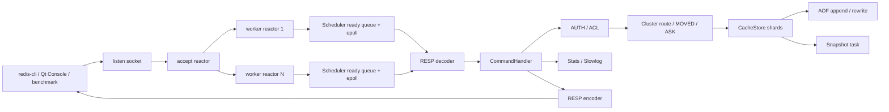

# 架构与持久化

## 项目结构

MiniRedis 按职责分层：

```text
include/miniredis/
├── core/          # KV 存储、内存池、线程池
├── net/           # epoll 调度器、RESP 编解码
├── persistence/   # 文件快照和持久化管理
├── metrics/       # stats 统计和 HTTP 暴露
├── cluster/       # Redis Cluster 风格 slot 路由和节点状态
└── server/        # 配置解析、命令处理、服务启动编排
```

`main.cpp` 只保留入口逻辑：解析配置并启动 `MiniRedisServer`。命令处理集中在 `server/command_handler`，服务生命周期集中在 `server/server`。

## 核心流程



```text
listen socket
  -> accept reactor
  -> round-robin dispatch fd
  -> worker reactor epoll
  -> coroutine resume
  -> RESP decode
  -> CommandHandler
  -> CacheStore / ClusterSlotMap / Stats
  -> RESP encode
  -> non-blocking write
```

网络层采用多 Reactor 模型：accept reactor 只负责监听 socket 和接收新连接，连接 fd 会按 round-robin 分发给 worker reactor。每个 worker reactor 拥有独立 `Scheduler`、epoll fd、eventfd 和 ready queue，客户端读写在对应 worker 线程内以 coroutine 方式执行。

## CacheStore

- 按 key hash 拆分为多个 shard，每个 shard 使用独立 `std::shared_mutex`
- 单 key 操作只锁命中的 shard，`snapshot()`、`cleanup()` 和统计类操作会遍历所有 shard
- value 小于等于 64B 时使用固定块内存池
- 大 value 自动走堆分配
- 支持 TTL、惰性删除和后台 cleanup
- `snapshot()` 只导出未过期 key，并保存 TTL key 的绝对过期时间
- 支持 `maxmemory` payload 估算内存上限
- 开启多 shard 时，`maxmemory` 会按 shard 均分为局部上限，避免单个 shard 抢占全部内存
- `noeviction` 策略在超限时拒绝写入
- `lru` 策略在超限时淘汰最近最少访问 key

## 持久化

快照文件使用二进制格式：

- magic header：`MINIREDIS_SNAPSHOT_V2`
- entry count
- 每条记录保存 `key_length`、`value_length`、`expire_at_ms`、key bytes、value bytes
- `expire_at_ms` 为 Unix 毫秒时间戳，0 表示永久 key
- 加载时限制最大 entry 数，避免损坏快照触发巨大内存申请
- 单条 key/value 长度做边界校验，异常文件会被拒绝加载
- 兼容读取 V1 二进制快照，V1 key 会按永久 key 恢复

保存流程：

1. 写入 `snapshot.tmp`
2. flush
3. `fsync(snapshot.tmp)`
4. 将旧 `snapshot.dat` 复制为 `snapshot.dat.bak`
5. `rename(snapshot.tmp, snapshot.dat)`
6. `fsync` 快照所在目录

这样可以避免进程崩溃时把正式快照覆盖成半截文件。启动加载时如果主快照损坏，会移动为 `.bad` 并尝试加载 `.bak` 备份。定时快照会提交到动态线程池异步执行；如果上一轮快照仍在执行，本轮会跳过，避免并发写同一个快照文件。新版本仍兼容读取 V1 二进制快照和旧版 `key value` 文本快照，但下一次保存会升级为 V2 二进制格式。

AOF 是可选增量日志，开启 `appendonly_file` 后，成功执行的 `SET`、`SETNX`、`APPEND`、`INCR/DECR`、`DEL`、`EXPIRE` 会追加到 AOF 文件。`SETNX`、`APPEND` 和整数自增类命令会记录为等价的最终 `SET`，AOF 记录使用 RESP array 编码内部命令，因此可以安全保存包含空格、换行或二进制内容的 key/value。TTL 在 AOF 中保存为 Unix 毫秒绝对过期时间，避免重启 replay 时把 TTL 重新续满。

启动恢复顺序：

1. 加载 snapshot
2. 读取当前内存快照
3. replay AOF 到这份快照数据上
4. 将合并后的数据加载回 CacheStore
5. 打开 AOF 进入追加写模式

`appendfsync` 支持 `no`、`everysec`、`always`。`BGREWRITEAOF` 会在后台线程基于当前内存快照生成 compact AOF，将多次覆盖、删除和过期后的历史命令压缩为每个存活 key 一条 `SET`/`PXAT` 记录；rewrite 期间的新写入会继续追加到旧 AOF，并同时进入 rewrite buffer。后台任务在收尾阶段短暂加锁，把增量 buffer 合并进临时文件，再通过 `fsync + rename` 原子替换正式 AOF。启动时会清理残留 `.rewrite.tmp`，rewrite 失败会保留旧 AOF、记录最后状态/错误并允许后续重试；rewrite buffer 设置上限，避免长时间 rewrite 时内存无限增长。

## 监控指标

stats HTTP server 是轻量同步实现，面向健康检查和低频监控。请求读取会循环到 HTTP header 完整，响应写回会循环直到全部发送完成，并对过大的请求头返回 431。

当前指标包括：

- total commands
- GET hits / misses
- hit rate
- key count
- used memory bytes / maxmemory bytes
- evicted keys
- memory pool used/free blocks
- connected / total / rejected connections
- command latency samples / avg / max
- slowlog length / threshold / max length
- resource protection limits：request/key/value/pipeline/output buffer/max clients
- snapshot running / last success / last failure / duration / key count
- AOF rewrite running / buffer bytes / last rewrite / duration / records / failures / last status / last error
